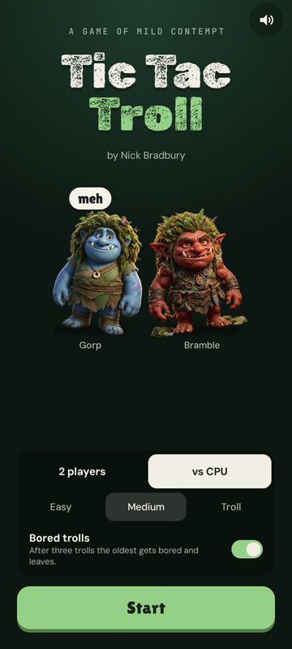
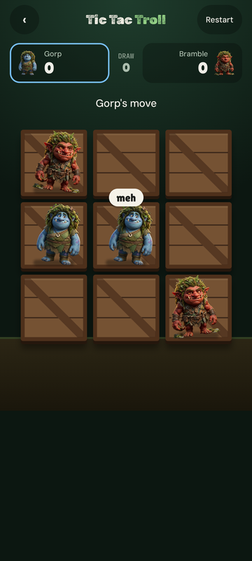
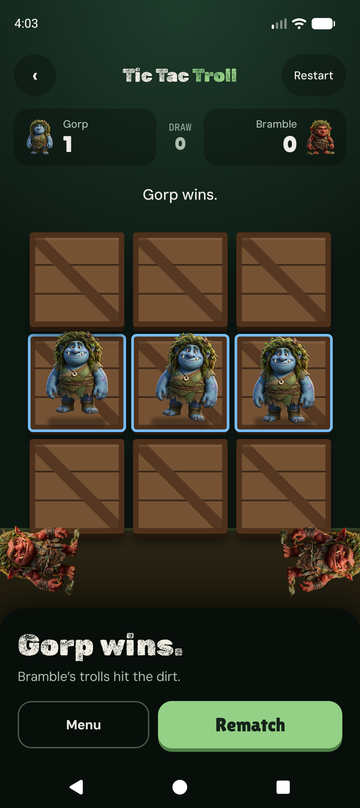

# Tic Tac Troll

*A game of mild contempt.* Tic-tac-toe for Android, played with trolls who glance at each other, grumble "meh" and "bleh", and topple off their crates into the dirt when they lose.

<p>
  
  
  
</p>

## Features

- **Play the CPU or a friend.** Three CPU skill levels: Easy (random), Medium (wins or blocks when it can, mostly), and Troll (minimax; never loses in classic games). Two-player mode is pass-and-play.
- **Bored trolls mode.** Each player keeps at most three trolls. Play a fourth and your oldest gets bored and pops like a bubble, so games can't end in a draw. The troll about to leave is dimmed.
- **Trolls with attitude.** They breathe, glance at their neighbors, turn to look at each new arrival, and grumble every few seconds, even after falling in the dirt. Block a winning line and the blocking troll says "bleh". Winners hop, losers fall off the board, and a draw gets a collective stare and a "meh" from everyone.
- **Sound.** Background music, a thunk as each troll lands, and an ending sound for every outcome: a fanfare for a win, a sad trombone for losing to the CPU, and a brass shrug for a tie. A toggle on the menu mutes everything, and the setting is remembered.
- **Feel.** Haptic ticks as trolls land, a ghost preview while your finger is on a crate, and Bramble has opinions about the difficulty you pick.
- **Accessible.** Works with TalkBack: every crate is labeled, moves (including the CPU's) are announced, and the layout holds up at large font sizes.
- **Rematches alternate** who goes first; Restart keeps the same starter.

## Building

Requires Android Studio (or JDK 17+ with the Android SDK). The app runs on Android 11 (API 30) and up.

```sh
./gradlew installDebug   # build and install on a connected device or emulator
./gradlew test           # unit tests, including an exhaustive check that Troll mode never loses a classic game
./gradlew detekt         # static analysis
```

## Project layout

```
app/src/main/java/com/nbradbury/tic_tac_troll/
  MainActivity.kt        entry point, sound setting, screen switching
  game/GameLogic.kt      board, rules (classic and bored trolls), win detection, CPU move selection
  game/GameViewModel.kt  game state, turns, timers for glances, chatter and the draw sequence
  ui/MenuScreen.kt       title, mode and skill selection, sound toggle
  ui/GameScreen.kt       scores, board, result sheet
  ui/Troll.kt            the animated troll and its speech bubble
  ui/Crate.kt            the wooden crate each cell is drawn as
  ui/GameSounds.kt       sound effects and troll voices
  ui/GameHaptics.kt      haptic feedback for landings and endings
  ui/BackgroundMusic.kt  looping music tied to the app lifecycle
```

## Credits

- Game design prototyped in Claude Design.
- Troll images created by Adobe Firefly.
- Background music: *Where the Trolls Tread* created by Google Gemini.
- Sound effects and troll voices are synthesized; the voices start from macOS speech and are pitched and roughened into trolls.
- Fonts: [Lilita One](https://fonts.google.com/specimen/Lilita+One), [Rubik Dirt](https://fonts.google.com/specimen/Rubik+Dirt), [DM Sans](https://fonts.google.com/specimen/DM+Sans) and [JetBrains Mono](https://fonts.google.com/specimen/JetBrains+Mono), all under the SIL Open Font License 1.1.

By Nick Bradbury.
